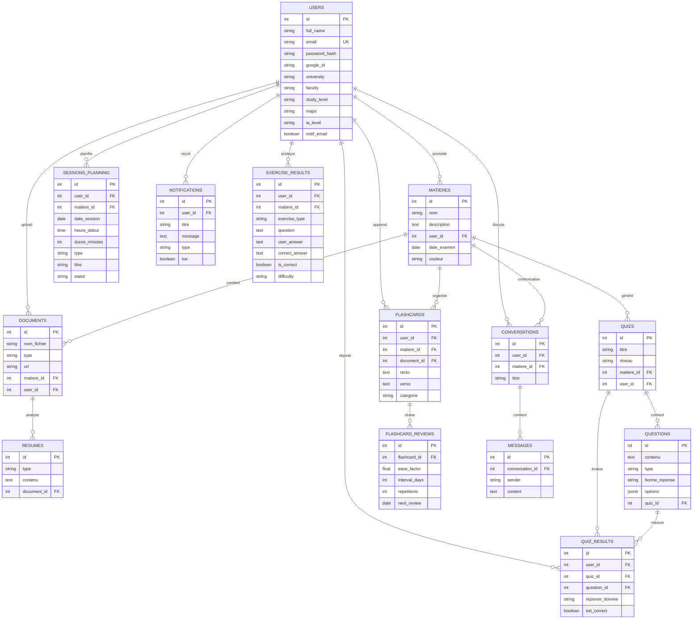
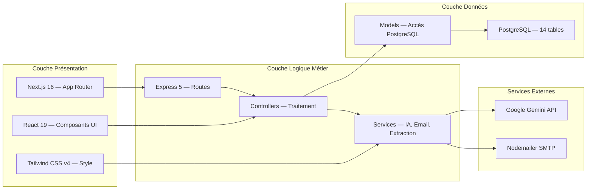

# Rapport de Stage

---

## Page de Garde

---

<div align="center">

# UNIVERSITÉ ISITCOM

## Institut Supérieur d'Informatique et des Technologies de Communication

---

# Rapport de Stage

## AI Study Assistant
### Application Web SaaS d'Aide à l'Étude par Intelligence Artificielle

---

**Auteur :** Oussema Mhiri
**Email :** oussemamhiri963@gmail.com

**Stage d'été de 2ème année**

**Entreprise d'accueil :** Mobelite
**Superviseur :** Mme Rania Wannes

**Année universitaire : 2025 / 2026**

</div>

---

## Remerciements

Je tiens à exprimer ma sincère gratitude envers toutes les personnes qui ont contribué à la réalisation de ce stage et de ce projet.

Je remercie tout particulièrement **Mme Rania Wannes**, ma superviseure chez Mobelite, pour sa confiance, ses conseils avisés et son accompagnement tout au long de ce stage. Sa disponibilité et son expertise ont été essentielles au bon déroulement de ce projet.

Je remercie également l'équipe de **Mobelite** pour leur accueil chaleureux et leur environment de travail stimulant, qui m'a permis de développer mes compétences tant techniques que professionnelles.

Enfin, je remercie l'**Université ISITCOM** et son corps enseignant pour la formation solide qui m'a permis de mener à bien ce projet.

---

## Table des matières

1. Introduction
2. Présentation de l'entreprise
3. Cahier des charges
4. Conception
5. Réalisation
6. Tests et validation
7. Bilan personnel
8. Conclusion

---

## 1. Introduction

### 1.1 Contexte du stage

Ce stage s'inscrit dans le cadre de la formation de deuxième année à l'Institut Supérieur d'Informatique et des Technologies de Communication (ISITCOM). D'une durée de [DURÉE] semaines, il a pour objectif de nous permettre de confronter nos connaissances théoriques aux réalités du monde professionnel.

### 1.2 Objectifs du stage

Les objectifs fixés pour ce stage étaient les suivants :

- Découper les méthodes de travail en entreprise dans le domaine du développement web
- Appliquer les connaissances acquises lors de la formation (HTML, CSS, JavaScript, Node.js, bases de données)
- Développer une application web complète intégrant l'intelligence artificielle
- Gérer un projet de A à Z : de la conception au déploiement
- Développer des compétences en travail d'équipe et en communication professionnelle

### 1.3 Présentation du projet

Le projet réalisé durant ce stage est **AI Study Assistant**, une application web SaaS conçue pour accompagner les étudiants universitaires dans leur parcours académique. L'application intègre l'intelligence artificielle (Google Gemini) pour offrir des fonctionnalités pédagogiques avancées : analyse automatique de cours, génération de quiz et d'exercices, chatbot contextuel, flashcards avec répétition espacée, et planning intelligent de révision.

---

## 2. Présentation de l'entreprise

### 2.1 Mobelite

**Mobelite** est une entreprise spécialisée dans le développement web et mobile, offrant des services de conception, développement et déploiement d'applications numériques. L'entreprise intervient dans divers secteurs et accompagne ses clients dans la réalisation de projets techniques innovants.

### 2.2 Organisation

L'entreprise est organisée en équipes spécialisées :

- **Équipe développement :** Développeurs frontend et backend
- **Équipe design :** UX/UI designers
- **Équipe management :** Chefs de projet et coordinateurs

### 2.3 Environnement technique

L'entreprise utilise des technologies modernes pour ses projets :

| Domaine | Technologies utilisées |
|---|---|
| Frontend | React, Next.js, Vue.js |
| Backend | Node.js, Express, Python |
| Bases de données | PostgreSQL, MongoDB |
| DevOps | Docker, CI/CD, Cloud |
| IA | Google Gemini, OpenAI |

---

## 3. Cahier des charges

### 3.1 Besoins fonctionnels

Le cahier des charges a été élaboré en collaboration avec le superviseur du stage. Les besoins identifiés sont les suivants :

#### Gestion de contenu

| Besoin | Priorité | Description |
|---|---|---|
| Gestion des matières | Haute | Créer, modifier, supprimer des matières d'étude |
| Upload de documents | Haute | Importer des fichiers PDF, DOCX, PPTX, images |
| Analyse IA | Haute | Analyser automatiquement les documents et générer des résumés |

#### Apprentissage actif

| Besoin | Priorité | Description |
|---|---|---|
| Quiz interactifs | Haute | Générer et passer des quiz QCM et Vrai/Faux |
| Exercices | Haute | Générer des exercices variés avec correction IA |
| Flashcards | Haute | Créer des fiches de révision avec répétition espacée |
| Chatbot | Haute | Poser des questions sur les cours avec un assistant IA |

#### Suivi et organisation

| Besoin | Priorité | Description |
|---|---|---|
| Planning de révision | Haute | Planifier et organiser les sessions d'étude |
| Suivi de progression | Haute | Visualiser les statistiques et le score de maîtrise |
| Notifications | Moyenne | Recevoir des rappels et alertes |

### 3.2 Besoins non fonctionnels

| Critère | Description |
|---|---|
| Sécurité | Authentification JWT, hachage des mots de passe, protection contre les abus |
| Performance | Temps de réponse < 2 secondes pour les opérations standard |
| Utilisabilité | Interface intuitive et responsive, navigation fluide |
| Maintenabilité | Code bien structuré, documentation technique |
| Portabilité | Compatible avec tous les navigateurs modernes |

### 3.3 Contraintes techniques

- **Frontend :** Framework React (Next.js) avec styled-components
- **Backend :** Node.js avec framework Express
- **Base de données :** PostgreSQL
- **API IA :** Google Gemini API
- **Déploiement :** Serveur local pour le développement, cloud pour la production

---

## 4. Conception

### 4.1 Méthodologie

La méthodologie adoptée pour ce projet est basée sur une approche itérative et incrémentale :

1. **Analyse des besoins :** Identification des fonctionnalités et contraintes
2. **Conception :** Modélisation de la base de données et architecture technique
3. **Développement itératif :** Implémentation par modules fonctionnels
4. **Tests :** Validation de chaque module avant passage au suivant
5. **Intégration :** Assemblage des modules et tests globaux

### 4.2 Modélisation de la base de données

La base de données est modélisée selon le modèle entité-relation. Le diagramme suivant présente les 14 tables et leurs relations :



### 4.3 Architecture technique

L'application suit une architecture client-serveur en couches :



### 4.4 Diagramme de cas d'utilisation

```mermaid
graph TB
    subgraph System["AI Study Assistant"]
        UC1[Inscription / Connexion]
        UC2[Gérer les matières]
        UC3[Uploader des documents]
        UC4[Analyser un document IA]
        UC5[Passer un quiz]
        UC6[Faire des exercices]
        UC7[Réviser des flashcards]
        UC8[Discuter avec le chatbot]
        UC9[Planifier des sessions]
        UC10[Consulter la progression]
        UC11[Gérer les notifications]
        UC12[Configurer son profil]
    end

    Student([Étudiant]) --> UC1
    Student --> UC2
    Student --> UC3
    Student --> UC4
    Student --> UC5
    Student --> UC6
    Student --> UC7
    Student --> UC8
    Student --> UC9
    Student --> UC10
    Student --> UC11
    Student --> UC12
```



---

## 5. Réalisation

### 5.1 Développement du Backend

#### 5.1.1 Configuration du serveur

Le serveur Express a été configuré avec les middlewares essentiels :

```javascript
// backend/src/app.js
const express = require('express');
const cors = require('cors');
const dotenv = require('dotenv');
const rateLimit = require('express-rate-limit');

dotenv.config();

const app = express();
const port = process.env.PORT || 5000;

// Middlewares
app.use(cors());
app.use(express.json());

// Rate limiting global
const globalLimiter = rateLimit({
  windowMs: 15 * 60 * 1000,
  max: 500,
  message: { message: 'Trop de requêtes, réessayez plus tard.' },
});
app.use(globalLimiter);
```

#### 5.1.2 Middleware d'authentification

Le middleware JWT vérifie le token sur toutes les routes protégées :

```javascript
// backend/src/middleware/auth.js
const jwt = require('jsonwebtoken');

const auth = (req, res, next) => {
  const token = req.header('Authorization')?.replace('Bearer ', '');
  if (!token) {
    return res.status(401).json({ message: 'Accès refusé' });
  }
  try {
    const decoded = jwt.verify(token, process.env.JWT_SECRET);
    req.userId = decoded.userId;
    next();
  } catch (error) {
    res.status(401).json({ message: 'Token invalide' });
  }
};
```

#### 5.1.3 Service d'analyse IA

Le pipeline d'analyse IA génère 4 types d'analyses en parallèle via Gemini :

```javascript
// backend/src/services/geminiService.js (extrait)
const generateSummary = async (text, type = 'court') => {
  const prompts = {
    court: "Fais un résumé court (2-3 phrases) de ce texte.",
    detaillé: "Fais un résumé détaillé (5-6 phrases) de ce texte.",
    points_cles: "Liste 5 points clés de ce texte.",
    definitions: "Extrait les termes techniques et leurs définitions en JSON.",
  };

  const model = genAI.getGenerativeModel({ model: 'gemini-3.1-flash-lite' });
  const result = await model.generateContent(prompts[type] + "\n\n" + text);
  return result.response.text();
};
```

#### 5.1.4 Système de flashcards SM-2

L'algorithme de répétition espacée SuperMemo 2 calcule la prochaine date de révision :

| Qualité | Signification | Effet |
|---|---|---|
| 0 | Encore | Reset complet, intervalle = 1 jour |
| 1 | Difficile | Reset complet, intervalle = 1 jour |
| 2 | Mauvais | Reset complet, intervalle = 1 jour |
| 3 | Bon | Intervalle × 1.0, EF ajusté |
| 4 | Facile | Intervalle × EF, EF augmenté |
| 5 | Très facile | Intervalle × EF, EF fortement augmenté |

Le facteur de facilité (EF) est calculé comme suit :

```
EF = EF + (0.1 - (5 - q) * (0.08 + (5 - q) * 0.02))
```

Où `q` est la qualité de la réponse (0-5). L'intervalle suit la progression : 1 jour → 6 jours → 18 jours → ...

### 5.2 Développement du Frontend

#### 5.2.1 Structure des pages

Le frontend utilise le路由 App Router de Next.js 16 :

| Page | Route | Description |
|---|---|---|
| Dashboard | `/dashboard` | Tableau de bord principal |
| Matières | `/matieres` | Gestion des matières et documents |
| Chatbot | `/chatbot` | Assistant IA conversationnel |
| Planning | `/planning` | Calendrier et sessions de révision |
| Notifications | `/notifications` | Centre de notifications |
| Paramètres | `/parametres` | Configuration du profil |
| Connexion | `/login` | Page de connexion |
| Inscription | `/register` | Page d'inscription |

#### 5.2.2 Contexte d'authentification

La gestion de l'état utilisateur est centralisée via React Context :

```javascript
// frontend/context/AuthContext.js (extrait)
const login = async (email, password) => {
  const response = await api.post('/auth/login', { email, password });
  const { token, user } = response.data;
  localStorage.setItem('token', token);
  setUser(user);
  router.push('/dashboard');
};
```

#### 5.2.3 Chatbot avec streaming SSE

Le chatbot utilise les Server-Sent Events pour afficher les réponses en temps réel :

```javascript
// frontend/context/ChatContext.js (extrait)
const sendMessage = async (conversationId, message) => {
  const response = await fetch(`${API_URL}/chatbot/conversations/${conversationId}/chat`, {
    method: 'POST',
    headers: { 'Authorization': `Bearer ${token}`, 'Content-Type': 'application/json' },
    body: JSON.stringify({ message }),
  });

  const reader = response.body.getReader();
  const decoder = new TextDecoder();

  while (true) {
    const { done, value } = await reader.read();
    if (done) break;
    const chunk = decoder.decode(value);
    // Parse SSE events et mise à jour de l'interface en temps réel
  }
};
```

### 5.3 Conception de l'interface utilisateur

L'interface utilisateur a été conçue selon les principes suivants :

- **Minimalisme :** Interface épurée sans éléments superflus
- **Cohérence visuelle :** Palette de couleurs unifiée, typographie cohérente
- **Accessibilité :** Contraste suffisant, navigation clavier, icônes explicites
- **Responsive :** Adaptation à toutes les tailles d'écran via Tailwind CSS
- **Feedback visuel :** Animations subtiles, indicateurs de chargement, notifications toast

---

## 6. Tests et Validation

### 6.1 Tests réalisés

| Type de test | Outil | Résultat |
|---|---|---|
| Tests API | Postman | Toutes les routes fonctionnelles |
| Tests d'authentification | Postman | Inscription, connexion, OTP, Google OAuth |
| Tests d'upload | Postman | PDF, DOCX, PPTX, images |
| Tests IA | Postman | Génération de résumés, quiz, exercices, chatbot |
| Tests frontend | Navigateur | Navigation, formulaires, streaming |
| Tests de sécurité | Code review | Rate limiting, JWT, isolation des données |

### 6.2 Problèmes rencontrés et solutions

| Problème | Solution |
|---|---|
| Parsing JSON Gemini parfois invalide | Ajout d'un fallback avec regex pour extraire les questions |
| Streaming SSE interrompu | Gestion des erreurs de connexion avec retry automatique |
| Upload PPTX complexe | Utilisation de adm-zip pour extraire le XML des diapositives |
| Score de maîtrise incohérent | Révision de la formule de calcul avec pondérations justifiées |
| Notifications non envoyées | Correction du cron service et vérification de la config email |

---

## 7. Bilan Personnel

### 7.1 Compétences acquises

Ce stage m'a permis de développer de nombreuses compétences :

**Compétences techniques :**

- Maîtrise approfondie de l'écosystème Node.js / Express
- Développement d'interfaces utilisateur modernes avec React et Tailwind CSS
- Intégration d'API d'intelligence artificielle (Google Gemini)
- Conception et administration de bases de données PostgreSQL
- Développement de systèmes d'authentification sécurisés (JWT, OAuth)
- Mise en œuvre de techniques de streaming (SSE) pour les interfaces temps réel
- Algorithmes de répétition espacée (SM-2)

**Compétences professionnelles :**

- Gestion autonome d'un projet de développement complet
- Travail en équipe et communication avec le superviseur
- Organisation du temps et respect des délais
- Rédaction de documentation technique
- Résolution de problèmes complexes

### 7.2 Difficultés rencontrées

- **Complexité de l'intégration IA :** Le format de sortie de Gemini n'est pas toujours structuré, nécessitant des mécanismes de parsing robustes
- **Gestion du streaming :** L'implémentation du SSE pour le chatbot a nécessité une compréhension approfondie des flux HTTP
- **Architecture du projet :** La séparation frontend/backend et la gestion de l'état global (Context API) ont demandé une planification rigoureuse

### 7.3 Ce que j'aurais aimé faire

- Implémenter des tests automatisés (Jest, Supertest)
- Ajouter le déploiement en production (Docker, CI/CD)
- Développer une version mobile (React Native)
- Implémenter les vraies notifications push

---

## 8. Conclusion

### 8.1 Synthèse

Ce stage chez Mobelite m'a permis de réaliser un projet complet et ambitieux : **AI Study Assistant**, une application web intégrant l'intelligence artificielle au service de l'apprentissage universitaire.

Le projet a atteint les objectifs fixés :

- **Fonctionnalités complètes :** Authentification, gestion de matières, analyse IA, quiz, exercices, flashcards, chatbot, planning, notifications
- **Technologies modernes :** React 19, Next.js 16, Express 5, PostgreSQL, Google Gemini
- **Architecture robuste :** Séparation des couches, sécurité, performances
- **Interface soignée :** Design moderne, responsive, thème sombre

### 8.2 Perspectives

Ce projet pourrait être enrichi par :

- Le déploiement en production avec Docker et CI/CD
- L'ajout de tests automatisés pour garantir la fiabilité
- Le développement d'une application mobile (React Native ou PWA)
- L'intégration de fonctionnalités collaboratives (partage entre étudiants)
- L'ajout de notifications push en temps réel

### 8.3 Conclusion générale

Ce stage a été une expérience extrêmement enrichissante, tant sur le plan technique que professionnel. J'ai pu développer des compétences concrètes en développement web full-stack, en intégration d'IA et en gestion de projet. Je remercie encore Mobelite et Mme Rania Wannes pour cette opportunité.

---

**Année universitaire : 2025 / 2026**
**ISITCOM — Institut Supérieur d'Informatique et des Technologies de Communication**
