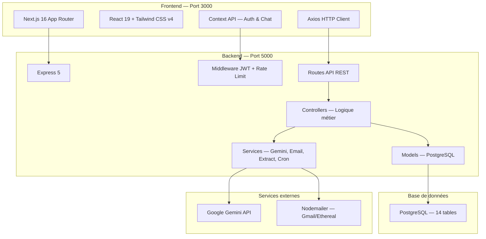
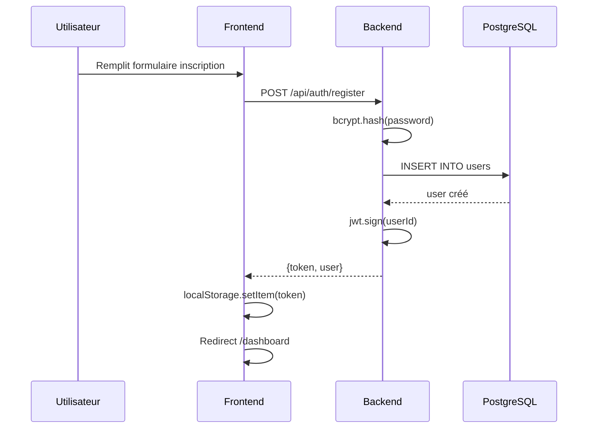
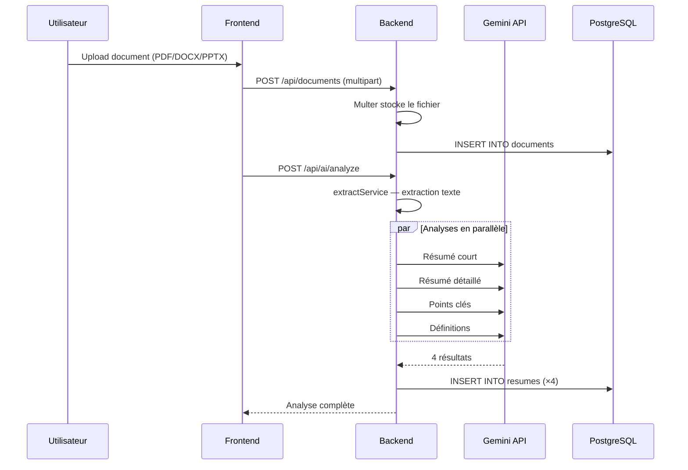
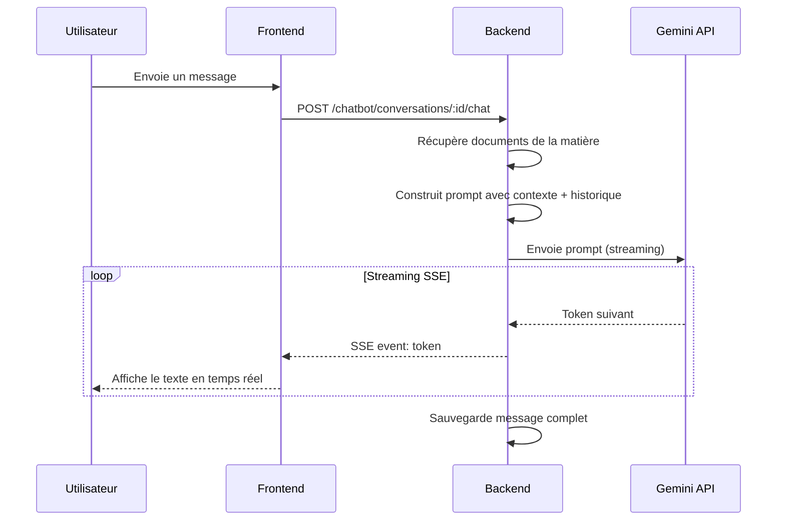
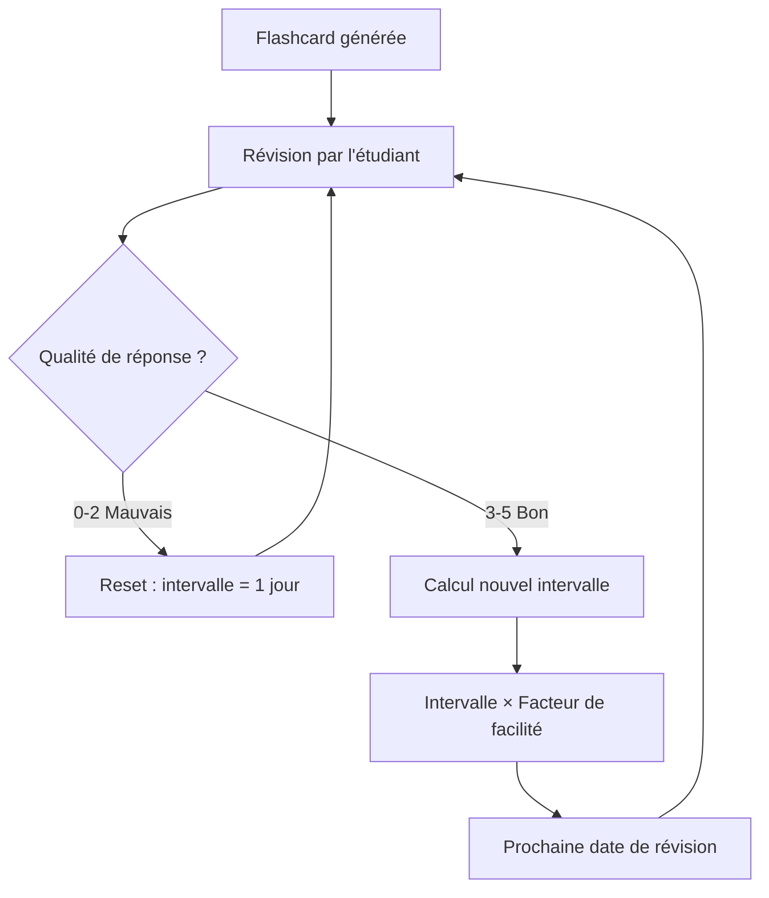
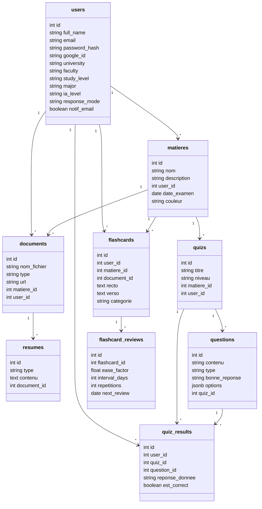

# Rapport Technique — AI Study Assistant

---

**Auteur :** Oussema Mhiri
**Email :** oussemamhiri963@gmail.com
**Stage d'été de 2ème année — Université ISITCOM**
**Entreprise :** Mobelite
**Superviseur :** Mme Rania Wannes
**Année universitaire :** 2025 / 2026

---

## 1. Introduction

### 1.1 Présentation du projet

AI Study Assistant est une application web SaaS conçue pour accompagner les étudiants universitaires dans leur parcours académique. Le projet combine l'intelligence artificielle (Google Gemini) avec des fonctionnalités pédagogiques avancées pour offrir une expérience d'apprentissage personnalisée et interactive.

### 1.2 Objectifs

- Automatiser l'analyse de cours et la génération de résumés
- Créer des quiz et exercices interactifs à partir de documents
- Offrir un chatbot pédagogique contextuel avec streaming en temps réel
- Planifier intelligemment les sessions de révision
- Suivre la progression de l'étudiant avec des métriques détaillées
- Générer des flashcards avec algorithme de répétition espacée SM-2

### 1.3 Contexte

Projet réalisé dans le cadre d'un stage d'été de 2ème année au sein de l'entreprise Mobelite, sous la supervision de Mme Rania Wannes.

---

## 2. Technologies Utilisées

### 2.1 Frontend

| Technologie | Version | Rôle |
|---|---|---|
| React | 19.2.4 | Bibliothèque UI composable |
| Next.js | 16.2.10 | Framework React (App Router) |
| Tailwind CSS | v4 | Framework CSS utility-first |
| Axios | 1.18.1 | Client HTTP avec intercepteur JWT |
| Lucide React | 1.24.0 | Bibliothèque d'icônes |
| react-hot-toast | 2.6.0 | Notifications toast |
| @react-oauth/google | 0.13.5 | Authentification Google OAuth 2.0 |

### 2.2 Backend

| Technologie | Version | Rôle |
|---|---|---|
| Node.js | — | Runtime JavaScript côté serveur |
| Express | 5.2.1 | Framework web minimaliste |
| PostgreSQL (pg) | 8.22.0 | Client PostgreSQL natif |
| jsonwebtoken | 9.0.3 | Authentification JWT (7j expiration) |
| bcryptjs | 3.0.3 | Hachage sécurisé des mots de passe |
| Multer | 2.2.0 | Upload de fichiers (max 50 Mo) |
| Nodemailer | 9.0.3 | Envoi d'e-mails (Gmail / Ethereal) |
| express-rate-limit | 8.6.0 | Protection contre le brute-force |

### 2.3 Intelligence Artificielle

| Technologie | Modèle | Utilisation |
|---|---|---|
| Google Gemini API | gemini-3.1-flash-lite | Génération de résumés, quiz, exercices, chatbot, suggestions, analyse d'images |

### 2.4 Extraction de texte

| Bibliothèque | Format supporté | Méthode |
|---|---|---|
| pdf-parse | PDF | Extraction texte natif |
| mammoth | DOCX | Conversion HTML → texte |
| adm-zip + xml2js | PPTX | Parsage XML des diapositives |
| Gemini Vision | JPG, PNG | Analyse d'images via IA |

---

## 3. Architecture Générale

Le projet suit une architecture client-serveur en couches séparées, garantissant une bonne séparation des responsabilités.

### 3.1 Principes architecturaux

- **Séparation frontend/backend :** Communication exclusivement via API REST
- **Middleware d'authentification :** Vérification JWT sur toutes les routes protégées
- **Modularité :** Chaque domaine (auth, matières, documents, IA, chat) a sa propre route, controller, model
- **Rate limiting :** Protection contre les abus (50 req/15min pour l'auth, 500 req/15min globalement)
- **Pipeline d'analyse IA :** Extraction → Gemini → Stockage en base, exécuté en parallèle

---

## 4. Structure des Dossiers

### 4.1 Backend (`backend/src/`)

| Fichier | Description |
|---|---|
| `app.js` | Point d'entrée Express : middleware, montage des routes, démarrage du serveur |
| `config/db.js` | Pool PostgreSQL (connexion via DATABASE_URL) |
| `config/initDb.js` | Création automatique des tables + migrations (14 tables) |
| `middleware/auth.js` | Middleware JWT : vérifie le token Bearer dans le header Authorization |
| `models/` (14 fichiers) | Modèles de données : User, Matiere, Document, Resume, Quiz, Question, QuizResult, Conversation, Message, Notification, SessionPlanning, Flashcard, FlashcardReview |
| `controllers/` (12 fichiers) | Logique métier : auth, subject, document, ai, quiz, exercise, chatbot, progress, planning, flashcard, dashboard, resource |
| `routes/` (12 fichiers) | Routes API REST montées sur /api/* |
| `services/` (6 fichiers) | Services métier : geminiService, analysisService, extractService, emailService, cronService, spacedRepetition |

### 4.2 Frontend (`frontend/`)

| Fichier | Description |
|---|---|
| `app/` | Pages Next.js (App Router) : dashboard, matières, chatbot, planning, notifications, paramètres, auth |
| `context/` | React Context : AuthContext (session utilisateur), ChatContext (conversations & streaming SSE) |
| `lib/api.js` | Instance Axios configurée avec intercepteur JWT automatique |
| `components/` | Composants réutilisables : Sidebar de navigation |
| `public/image/` | Images statiques (Login.png, register.png) |

---

## 5. Fonctionnalités Détaillées

### 5.1 Authentification & Gestion de session

Système d'authentification complet avec plusieurs méthodes de connexion et sécurisation par JWT.

**Backend — `authController.js`, `middleware/auth.js`**

- Inscription : nom, email, mot de passe (bcrypt), université, faculté, niveau d'études, filière
- Connexion : email + mot de passe avec validation bcrypt
- Google OAuth 2.0 : vérification du token Google, création automatique ou liaison de compte
- Réinitialisation de mot de passe en 3 étapes : demande OTP → vérification OTP (6 chiffres, valide 5 min) → réinitialisation via token JWT temporaire
- JWT : token signé avec JWT_SECRET, expiration 7 jours, stocké dans localStorage
- Rate limiting : 50 requêtes/15 min pour l'auth, 500 requêtes/15 min globalement

**Frontend — `AuthContext.js`, pages `(auth)/*`**

- Gestion de l'état utilisateur via React Context (persistance au rechargement via GET /auth/me)
- Interface responsive avec illustrations (Login.png, register.png)
- Redirection automatique vers /dashboard après connexion
- Notifications toast pour succès/erreurs

### 5.2 Gestion des Matières

CRUD complet pour l'organisation des cours par matière, avec isolation par utilisateur.

- Attributs : nom, description, date d'examen, couleur personnalisable (hex)
- Comptage automatique du nombre de documents par matière (LEFT JOIN documents)
- Isolation : chaque utilisateur ne voit que ses propres matières

### 5.3 Import & Analyse de Documents

Pipeline d'analyse IA complet : upload → extraction de texte → analyse Gemini → stockage en base.

**Upload & Extraction**

- Upload via Multer : PDF, DOCX, PPTX, JPG, PNG (max 50 Mo)
- Extraction automatique : PDF (pdf-parse), DOCX (mammoth), PPTX (adm-zip + xml2js), Images (Gemini Vision)

**Pipeline d'analyse IA (`analysisService.js`)**

1. Extraction du texte brut du fichier uploadé
2. Génération de 4 types d'analyses via Gemini (exécutées en parallèle) :
   - Résumé court (2-3 phrases) — vue rapide du contenu
   - Résumé détaillé (5-6 phrases) — compréhension approfondie
   - Points clés (liste de 5 éléments) — informations essentielles
   - Définitions (JSON [{terme, definition}]) — vocabulaire clé
3. Stockage de chaque analyse en base (table `resumes`)
4. Récupération : `GET /ai/analysis/:documentId`

### 5.4 Chatbot IA Pédagogique

Chatbot intelligent avec streaming en temps réel, contexte de documents et historique de conversation.

- Conversations : création, historique, suppression par matière
- Contexte : le chatbot utilise le texte extrait des documents de la matière (ou d'un document spécifique)
- Streaming SSE (Server-Sent Events) : les réponses sont envoyées caractère par caractère en temps réel
- Historique : les 10 derniers messages sont inclus dans le prompt pour maintenir la cohérence
- Support d'images : envoi d'images en base64 pour analyse visuelle via Gemini Vision
- Suggestions intelligentes : génération de 3 questions pertinentes basées sur les documents
- Limite de contexte : 40 000 caractères max pour éviter la saturation du prompt

### 5.5 Quiz & Exercices Interactifs

Génération automatique de quiz QCM et d'exercices via Gemini, avec correction IA pour les exercices.

**Quiz — `quizController.js`**

- Génération de questions via Gemini à partir d'un document
- Types de questions : QCM (60%) + Vrai/Faux (40%), mélange automatique
- Paramètres : nombre de questions (1-50), difficulté (Facile / Moyen / Difficile)
- Stockage en base : quiz + questions avec options au format JSONB
- Format QCM : questions à 4 propositions (A, B, C, D) avec réponse correcte
- Format Vrai/Faux : 2 options (Vrai/Faux) avec réponse correcte

**Exercices — `exerciseController.js`**

- Génération d'exercices variés via Gemini : QCM, Vrai/Faux, questions ouvertes, exercices à trous
- 4 types d'exercices :
  - `qcm` : questions à choix multiples avec 4 options
  - `true_false` : affirmations à valider (Vrai/Faux)
  - `ouverte` : questions nécessitant une réponse rédigée
  - `fill_in_blank` : phrases avec trous à compléter (marques par ___)
- Correction IA : soumission des réponses à Gemini pour évaluation avec feedback personnalisé
- Persistance : les résultats d'exercices sont sauvegardés en base pour le suivi de progression
- Fallback : comparaison directe pour les QCM/Vrai/Faux si parsing JSON échoue

**Niveau adaptatif**

- L'utilisateur peut choisir entre difficulté manuelle (Facile/Moyen/Difficile) ou adaptatif
- Mode adaptatif : commence à Facile, s'ajuste automatiquement selon les performances
- Calcul basé sur les 20 derniers résultats (quiz + exercices) avec pondération (60% quiz, 40% exercices)
- Score >= 80% → Difficile, >= 50% → Moyen, < 50% → Facile

### 5.6 Flashcards & Répétition Espacée

Génération de flashcards via Gemini avec algorithme SM-2 pour optimiser la rétention à long terme.

- Génération de flashcards via Gemini à partir d'un document
- 4 catégories : définition, concept, formule, exemple
- Algorithme SM-2 (SuperMemo 2) pour la répétition espacée :
  - Qualité de réponse : 0 (Encore) à 5 (Très facile)
  - Facteur de facilité (EF) ajusté selon la performance
  - Intervalle de révision : 1j → 6j → 18j → ... (progressif)
  - Reset complet si qualité < 3 (mauvaise réponse)
- Calcul de la prochaine révision : date basée sur l'intervalle et le facteur de facilité
- Statistiques : total cartes, cartes à réviser, cartes maîtrisées, facilité moyenne

### 5.7 Planning de Révision Intelligent

Gestion des sessions de révision avec génération automatique de planning par l'IA, basée sur le contenu des documents.

- CRUD des sessions : création, lecture (par mois/année), mise à jour, suppression
- Types de session : révision (chatbot, résumé, flashcard) et exercices (exercices, QCM, vrai/faux)
- Attributs : date, heure de début, durée (minutes), statut (planifié/complet)
- Génération IA du planning : envoi du contexte (matière, documents, résumés, date examen, jours restants, disponibilité) à Gemini qui retourne un planning optimisé en JSON
- Notifications : à la création d'une session, une notification in-app et un e-mail sont générés automatiquement

### 5.8 Suivi de Progression

Dashboard de progression avec score de maîtrise pondéré et analyse IA personnalisée.

**Score de maîtrise composite :**

| Composante | Pondération | Source |
|---|---|---|
| Quiz | 40% | Taux de réussite moyen aux quiz |
| Documents | 20% | Nombre de documents analysés |
| Flashcards | 20% | Nombre de cartes maîtrisées |
| Sessions complétées | 20% | Sessions terminées / sessions totales |

- Statistiques détaillées : documents, quiz, questions, conversations, messages
- Taux de réussite par matière et par quiz
- Estimation du temps restant avant l'examen
- Analyse IA personnalisée : Gemini génère des conseils basés sur les statistiques
- Enregistrement des résultats de quiz : réponses individuelles avec statut correct/incorrect

### 5.9 Notifications & Rappels

Système de notifications in-app avec rappels automatiques par cron et e-mail.

- Notifications in-app : création automatique (rappels, sessions planifiées)
- Marquage lu/non-lu (individuel ou toutes d'un coup)
- Cron service : vérification toutes les heures des sessions du lendemain
- Envoi de notification in-app + e-mail de rappel (format HTML)
- Types : rappel, planning, système
- Préférence `notif_email` : l'utilisateur peut activer/désactiver les e-mails de notification

### 5.10 Paramètres Utilisateur

Personnalisation du profil, des préférences IA et du thème de l'application.

- Profil : nom, email (lecture), université, faculté, niveau d'études, filière (édition)
- Préférences IA : niveau d'explication (Simple/Moyen/Avancé), mode de réponse (Court/Détaillé/Personnalisé)
- Thème : mode clair/sombre (persisté dans localStorage + classe dark sur html)
- Notifications push et emails de résumé (toggles activables)

---

## 6. Base de Données

La base de données PostgreSQL contient 14 tables relationnelles, créées automatiquement au démarrage via `initDb.js` avec gestion des migrations.

### 6.1 Tables principales

| Table | Description | Colonnes clés |
|---|---|---|
| `users` | Utilisateurs du système | id, full_name, email, password_hash, google_id, university, faculty, study_level, major, ia_level, response_mode, notif_email, reset_token |
| `matieres` | Matières de l'étudiant | id, nom, description, user_id (FK), date_examen, couleur, created_at |
| `documents` | Fichiers uploadés | id, nom_fichier, type, url, matiere_id (FK), user_id (FK), uploaded_at |
| `resumes` | Analyses IA des documents | id, type (court/détaillé/points_cles/définitions), contenu, document_id (FK), created_at |
| `quizs` | Quiz générés | id, titre, niveau, matiere_id (FK), user_id (FK), created_at |
| `questions` | Questions de quiz | id, contenu, type (qcm/true_false), bonne_reponse, options (JSONB), quiz_id (FK) |
| `quiz_results` | Réponses aux quiz | id, user_id (FK), quiz_id (FK), question_id (FK), reponse_donnee, est_correct, answered_at |
| `exercise_results` | Résultats d'exercices | id, user_id (FK), matiere_id (FK), exercise_type, question, user_answer, correct_answer, is_correct, difficulty, answered_at |
| `conversations` | Sessions chatbot | id, user_id (FK), matiere_id (FK), document_id (FK), titre, created_at |
| `messages` | Messages de chat | id, conversation_id (FK), sender (user/ia), content, created_at |
| `sessions_planning` | Sessions de révision | id, user_id (FK), matiere_id (FK), date_session, heure_debut, duree_minutes, type, titre, statut |
| `notifications` | Notifications in-app | id, user_id (FK), titre, message, type, lue, created_at |
| `flashcards` | Flashcards de révision | id, user_id (FK), matiere_id (FK), document_id (FK), recto, verso, categorie, created_at |
| `flashcard_reviews` | Historique de révision SM-2 | id, flashcard_id (FK), user_id (FK), ease_factor, interval_days, repetitions, next_review, last_review, quality, created_at |

### 6.2 Diagramme entité-relation

### 6.3 Relations entre les tables

- **users :** Table centrale — toutes les autres tables sont liées via `user_id` avec `ON DELETE CASCADE`
- **matieres :** Organisent les documents, quiz, conversations, sessions et flashcards
- **documents :** Liés à une matière, analysés pour produire des `resumes`
- **quizs → questions :** Relation un à plusieurs, options stockées en JSONB
- **flashcards → flashcard_reviews :** Système de révision avec algorithme SM-2
- **quiz_results :** Table de jointure pour le suivi des réponses
- **exercise_results :** Suivi des résultats d'exercices (pour difficulté adaptative)

---

## 7. APIs Principales

L'API suit une architecture RESTful. Toutes les routes sont préfixées par `/api/`. L'authentification est requise sur les routes marquées « Oui » (header `Authorization: Bearer <token>`).

### 7.1 Authentification

| Méthode | Endpoint | Description | Auth |
|---|---|---|---|
| POST | `/api/auth/register` | Inscription d'un nouvel utilisateur | Non |
| POST | `/api/auth/login` | Connexion (email + mot de passe) | Non |
| POST | `/api/auth/google` | Connexion / inscription via Google OAuth | Non |
| POST | `/api/auth/request-reset-code` | Demander un code OTP de réinitialisation | Non |
| POST | `/api/auth/verify-reset-code` | Vérifier le code OTP (6 chiffres) | Non |
| POST | `/api/auth/reset-password` | Réinitialiser le mot de passe (token temporaire) | Non |
| GET | `/api/auth/me` | Récupérer le profil de l'utilisateur connecté | Oui |
| PUT | `/api/auth/profile` | Mettre à jour le profil | Oui |
| PUT | `/api/auth/preferences` | Mettre à jour les préférences IA | Oui |

### 7.2 Matières

| Méthode | Endpoint | Description | Auth |
|---|---|---|---|
| GET | `/api/subjects` | Lister les matières de l'utilisateur | Oui |
| POST | `/api/subjects` | Créer une nouvelle matière | Oui |
| PUT | `/api/subjects/:id` | Modifier une matière | Oui |
| DELETE | `/api/subjects/:id` | Supprimer une matière | Oui |

### 7.3 Documents

| Méthode | Endpoint | Description | Auth |
|---|---|---|---|
| POST | `/api/documents` | Upload d'un document (multipart/form-data) | Oui |
| GET | `/api/documents/:matiereId` | Lister les documents d'une matière | Oui |
| DELETE | `/api/documents/:id` | Supprimer un document | Oui |

### 7.4 Intelligence Artificielle

| Méthode | Endpoint | Description | Auth |
|---|---|---|---|
| POST | `/api/ai/analyze` | Lancer l'analyse IA d'un document (4 analyses en parallèle) | Oui |
| GET | `/api/ai/analysis/:documentId` | Récupérer les analyses d'un document | Oui |

### 7.5 Quiz

| Méthode | Endpoint | Description | Auth |
|---|---|---|---|
| POST | `/api/quizzes/generate` | Générer un quiz QCM à partir d'un document | Oui |

### 7.6 Exercices

| Méthode | Endpoint | Description | Auth |
|---|---|---|---|
| POST | `/api/exercises/generate` | Générer des exercices (4 types) | Oui |
| POST | `/api/exercises/check` | Corriger des exercices via IA (feedback personnalisé) | Oui |

### 7.7 Chatbot

| Méthode | Endpoint | Description | Auth |
|---|---|---|---|
| GET | `/api/chatbot/subjects/:matiereId/conversations` | Lister les conversations d'une matière | Oui |
| POST | `/api/chatbot/conversations` | Créer une nouvelle conversation | Oui |
| GET | `/api/chatbot/conversations/:id/messages` | Récupérer les messages d'une conversation | Oui |
| DELETE | `/api/chatbot/conversations/:id` | Supprimer une conversation | Oui |
| POST | `/api/chatbot/conversations/:id/chat` | Envoyer un message (réponse SSE streaming) | Oui |
| GET | `/api/chatbot/subjects/:matiereId/suggestions` | Obtenir des suggestions de questions | Oui |

### 7.8 Progression

| Méthode | Endpoint | Description | Auth |
|---|---|---|---|
| GET | `/api/progress/:matiereId` | Dashboard de progression complet | Oui |
| GET | `/api/progress/adaptive-difficulty/:matiereId` | Difficulté adaptative (score + recommandation) | Oui |
| POST | `/api/progress/quiz-result` | Enregistrer les résultats d'un quiz | Oui |

### 7.9 Planning & Notifications

| Méthode | Endpoint | Description | Auth |
|---|---|---|---|
| GET | `/api/planning/sessions` | Récupérer les sessions du mois (query: month, year) | Oui |
| POST | `/api/planning/sessions` | Créer une session de révision | Oui |
| PATCH | `/api/planning/sessions/:id` | Modifier une session | Oui |
| DELETE | `/api/planning/sessions/:id` | Supprimer une session | Oui |
| POST | `/api/planning/generate` | Générer un planning IA optimisé | Oui |
| GET | `/api/planning/notifications` | Notifications + count non lues | Oui |
| PATCH | `/api/planning/notifications/:id/read` | Marquer comme lu (id=all pour toutes) | Oui |

### 7.10 Flashcards

| Méthode | Endpoint | Description | Auth |
|---|---|---|---|
| POST | `/api/flashcards/generate` | Générer des flashcards à partir d'un document | Oui |
| GET | `/api/flashcards/subject/:matiereId` | Lister les flashcards d'une matière | Oui |
| GET | `/api/flashcards/subject/:matiereId/due` | Cartes à réviser aujourd'hui | Oui |
| GET | `/api/flashcards/subject/:matiereId/stats` | Statistiques flashcards | Oui |
| POST | `/api/flashcards/:id/review` | Enregistrer une réponse (0-5, SM-2) | Oui |
| DELETE | `/api/flashcards/:id` | Supprimer une flashcard | Oui |

### 7.11 Dashboard

| Méthode | Endpoint | Description | Auth |
|---|---|---|---|
| GET | `/api/dashboard` | Données du tableau de bord global (score, stats, matières) | Oui |

### 7.12 Routes de test

| Méthode | Endpoint | Description | Auth |
|---|---|---|---|
| GET | `/api/test` | Test de l'API (health check) | Non |
| GET | `/api/test-gemini` | Test de connexion à Gemini API | Non |
| POST | `/api/test-summary` | Test de génération de résumé IA | Non |

---

## 8. Sécurité

### 8.1 Authentification & Autorisation

- **JWT (JSON Web Token) :** Token signé avec `JWT_SECRET`, expiration de 7 jours
- **Bcrypt :** Hachage des mots de passe avec salt factor de 10
- **Middleware d'authentification :** Vérification du header `Authorization: Bearer <token>` sur toutes les routes protégées
- **Google OAuth 2.0 :** Vérification du token Google via `google-auth-library`

### 8.2 Protection contre les abus

- **Rate limiting global :** 500 requêtes / 15 minutes (via `express-rate-limit`)
- **Rate limiting auth :** 50 requêtes / 15 minutes (endpoints d'inscription/connexion)
- **Isolation des données :** Chaque utilisateur ne peut accéder qu'à ses propres matières, documents et quiz

### 8.3 Sécurité des données

- **Variables d'environnement :** Clés et secrets stockés dans `.env` (non versionnés)
- **HTTPS :** Recommandé pour la production
- **Validation des entrées :** Vérification des types et formats côté serveur

---

## 9. Conclusion

### 9.1 Bilan du projet

AI Study Assistant est une application web complète et fonctionnelle qui intègre de manière cohérente l'intelligence artificielle (Google Gemini) dans un workflow d'apprentissage universitaire. Le projet couvre l'ensemble du parcours étudiant :

- **Organisation :** Matières, documents, planning de révision
- **Apprentissage actif :** Quiz (QCM + Vrai/Faux), exercices (4 types), flashcards avec répétition espacée SM-2, chatbot pédagogique contextuel
- **Suivi :** Progression chiffrée, score de maîtrise composite, difficulté adaptative, analyse IA personnalisée
- **Expérience utilisateur :** Interface moderne (Tailwind CSS v4), thème sombre, streaming SSE en temps réel, révision interactive de flashcards

Le stack technique est moderne et cohérent (React 19, Next.js 16, Express 5, PostgreSQL, Gemini API). L'architecture en couches assure une bonne séparation des responsabilités. Le pipeline d'analyse IA (extraction → Gemini → stockage) est bien structuré et supporte plusieurs formats de fichiers (PDF, DOCX, PPTX, images).

Le système de difficulté adaptative analyse les performances passées (quiz + exercices) pour ajuster automatiquement le niveau, offrant une expérience d'apprentissage personnalisée. Les flashcards avec l'algorithme SM-2 optimisent la rétention à long terme.

### 9.2 Pistes d'amélioration

1. **Tests unitaires et d'intégration :** Ajouter Jest + Supertest pour les controllers, services et models
2. **Validation des entrées :** Renforcer la validation côté serveur avec Joi ou Zod
3. **Sécurité :** HTTPS, sanitisation du contenu HTML, gestion avancée des erreurs
4. **Performance :** Mise en cache des analyses IA, pagination, optimisation des requêtes SQL
5. **Déploiement :** Dockeriser l'application, CI/CD, déploiement cloud (Vercel + Railway/Render)
6. **Notifications push :** Service Workers pour les vraies notifications navigateur
7. **Collaboration :** Partage de documents et de quiz entre étudiants
8. **Application mobile :** React Native ou PWA pour un accès mobile
9. **Mode hors-ligne :** Cache des cours et quiz pour utilisation sans connexion
10. **Analytics :** Tableau de bord d'utilisation pour suivre les habitudes d'étude

---

*Fin du rapport technique*
